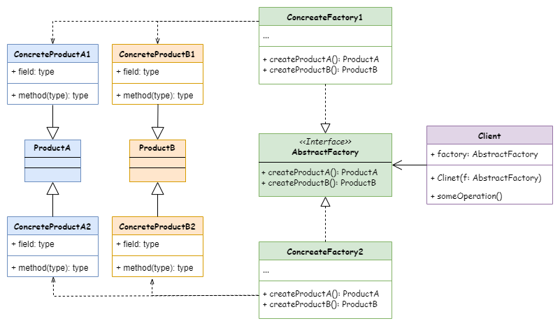

# Abstract Factory
抽象工厂模式。

## 意图
抽象工厂模式是一种创建型设计模式， 它能创建一系列相关的对象， 而无需指定其具体类。

## 模式结构

## 应用场景
- 如果代码需要与多个不同系列的相关产品交互， 但是由于无法提前获取相关信息， 或者出于对未来扩展性的考虑， 你不希望代码基于产品的具体类进行构建， 在这种情况下， 你可以使用抽象工厂。
- 如果你有一个基于一组抽象方法的类， 且其主要功能因此变得不明确， 那么在这种情况下可以考虑使用抽象工厂模式。

## 代码示例
- [家具工厂](../../src/abstract_factory/Furniture.h)