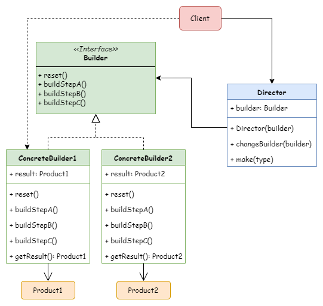

# Builder
生成器（建造者）模式

## 意图
生成器模式是一种创建型设计模式， 使你能够分步骤创建复杂对象。 该模式允许你使用相同的创建代码生成不同类型和形式的对象。

## 模式结构

## 应用场景
- 当希望避免 “重叠构造函数 （telescoping constructor）” 的出现时，可以使用生成器模式。
- 当希望使用代码创建不同形式的产品 （例如石头或木头房屋） 时， 可使用生成器模式。
- 构造组合树或其他复杂对象时，可以考虑使用生成器模式。

## 代码示例
- [生产自行车](../../src/builder/Bike.h)