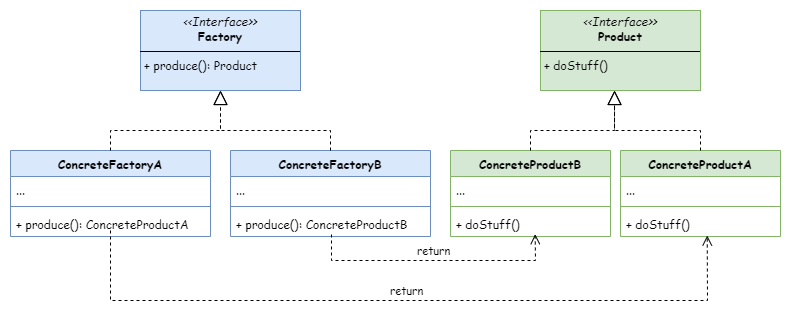

# Factory Method
工厂方法模式。

## 意图
工厂方法模式是一种创建型设计模式， 其在父类中提供一个创建对象的方法， 允许子类决定实例化对象的类型。

## 模式结构

## 应用场景
- **当对象的创建复杂或不确定时**：如果对象的创建依赖于复杂的逻辑，或者在编译时无法确定具体要实例化的类，工厂方法模式可以提供一种解决方案。

- **当需要将客户端与对象创建代码解耦时**：工厂方法模式可以将对象的创建逻辑封装在工厂类中，客户端代码只需要关心对象的接口，而不需要知道具体的实现类。

- **当需要添加新产品时**：如果系统中需要添加新产品，使用工厂方法模式可以避免修改现有代码，只需要添加新的创建者子类并重写工厂方法。

- **当需要扩展软件库或框架的内部组件时**：如果希望用户能够扩展软件库或框架，工厂方法模式允许用户通过继承和重写工厂方法来引入新的组件。

### 代码示例
- [积木工厂](../../src/factory_method/Block.h)