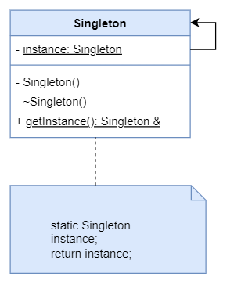

# Singleton
单例模式。

## 意图
单例模式是一种创建型设计模式， 让你能够保证一个类只有一个实例， 并提供一个访问该实例的全局节点。

## 模式结构


## 实现
### 内部静态变量懒汉式👍
自 C++ 11 起线程安全，推荐使用这种方式。
```c++
class Singleton {
public:
    static Singleton &getInstance() {
        static Singleton instance;
        return instance;
    }
private:
    Singleton() noexcept {}
    ~Singleton() {}
};
```

### 饿汉式
饿汉式是线程安全的。

```c++
class Singleton {
public:
    static Singleton &getInstance() {
        return *p_instance;
    }
private:
    Singleton() noexcept {}
    ~Singleton() {}
    static Singleton * p_instance;
};

// 在静态存储区（data section）构建全局对象
Singleton * Singleton::p_instance = new Singleton();
```

### 懒汉式（不加锁）
非线程安全。
```c++
class Singleton {
public:
    static Singleton &getInstance() {
        if (p_instance == nullptr) {
            p_instance = new Singleton();
        }
        return *p_instance;
    }
private:
    Singleton() noexcept {}
    ~Singleton() {}
    static Singleton * p_instance;
};

Singleton * Singleton::p_instance = nullptr;
```

### 饿汉式（加锁）
线程安全，但是性能开销大。
```c++
class Singleton {
public:
    static Singleton &getInstance() {
        lock_guard<mutex> lck(mtx);
        if (p_instance == nullptr) {
            p_instance = new Singleton();
        }
        return *p_instance;
    }
private:
    mutable mutex mtx;
    Singleton() noexcept {}
    ~Singleton() {}
    static Singleton * p_instance;
};

Singleton * Singleton::p_instance = nullptr;
```

### 应用场景
- 资源管理：当某个资源需要频繁访问，并且创建或销毁成本较高时，如数据库连接、文件系统、网络资源等，单例模式可以确保资源被有效管理和复用。
- 配置管理：配置信息通常在应用程序中只需要一个实例，如全局配置、环境设置等。
- 日志记录：日志记录器通常只需要一个实例来记录应用程序的日志信息。
- 线程池：线程池管理线程的创建和销毁，使用单例模式可以避免创建过多的线程池实例。

### 代码示例
[购物车](../../src/singleton/Cart.h)